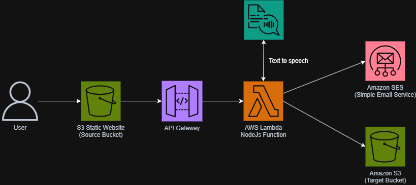

# 🎙️ Serverless Text-to-Speech Converter (AWS)

## 📌 Descripción del Proyecto
Aplicación web serverless que permite a los usuarios convertir texto a voz de alta fidelidad. La arquitectura está completamente desacoplada y basada en eventos, garantizando alta disponibilidad y escalabilidad automática sin necesidad de administrar servidores. 

## 🏗️ Arquitectura de la Solución
El flujo de procesamiento es asíncrono desde la perspectiva de la entrega, utilizando los siguientes servicios administrados:

1. **Frontend:** Alojado estáticamente en **Amazon S3**.
2. **API:** Expuesta mediante **Amazon API Gateway** (REST API con integración Proxy).
3. **Cómputo:** Lógica de orquestación centralizada en **AWS Lambda** (Node.js 20.x).
4. **Inteligencia Artificial:** Síntesis de voz neuronal utilizando **Amazon Polly**.
5. **Almacenamiento Seguro:** Generación de URLs presignadas temporales sobre objetos en **Amazon S3**.
6. **Notificación:** Envío automatizado de correos electrónicos transaccionales con **Amazon SES**.

## 🛠️ Tecnologías Utilizadas
* **Backend:** Node.js, AWS SDK v3.
* **Frontend:** HTML5, CSS3, JavaScript (Fetch API).
* **Infraestructura Cloud:** AWS IAM, API Gateway, Lambda, Polly, S3, SES, CloudWatch (para logs y monitoreo).

## 🚀 Despliegue y Configuración
Pasos para replicar este entorno en una cuenta de AWS:

1. **SES:** Verificar las identidades de correo (remitente y destinatarios en caso de estar en Sandbox).
2. **S3:** Crear un bucket público para el frontend y un bucket privado para los archivos `.mp3`.
3. **IAM:** Crear un rol de ejecución para Lambda con políticas para `polly:SynthesizeSpeech`, `s3:PutObject/GetObject`, y `ses:SendEmail`.
4. **Lambda:** Desplegar el código fuente adjunto en el repositorio y configurar las variables de entorno (`BUCKET_NAME`, `SENDER_EMAIL`). Ajustar el timeout a 15 segundos.
5. **API Gateway:** Crear el endpoint POST, habilitar la integración Proxy de Lambda y habilitar CORS.
6. **Frontend:** Actualizar la variable `API_URL` en el `index.html` y subir los archivos al bucket S3 público.

## 💡 Próximas Mejoras (Future Work)
* Integrar Amazon DynamoDB para mantener un registro histórico de las conversiones solicitadas.
* Automatizar el despliegue de la infraestructura utilizando Infraestructura como Código (IaC) con AWS CloudFormation o Terraform.
